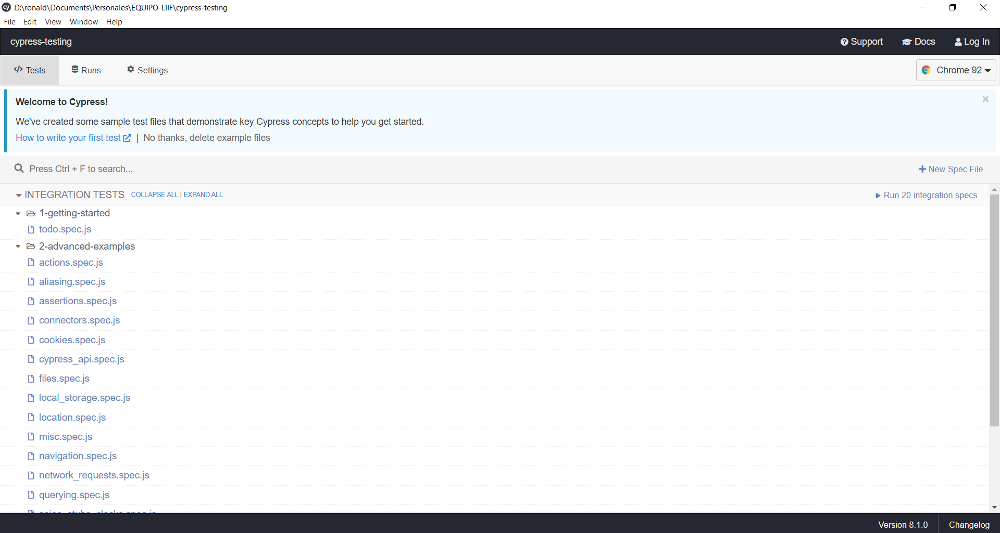

# E2E Testing using Cypress
En el siguiente repositorio se detalla un resumen de lo aprendido en el curso de cypress. 

## Instalación

```shell
npm init -y
npm install cypress
```

El primer comando crea un nuevo archivo package.json, para iniciar un proyecto de node. 

El segundo comando instala cypress en el proyecto, esto es necesario para mantener separados los proyectos y manejar cypress desde cada uno. 

## Verificación
Para verificar que cypress se haya instalado correctamente, ejecuta el siguiente comando. El cual abrirá una nueva ventana, tal como se muestra a continuación. 

```shell
npx cypress open
```



> Cypress test runner